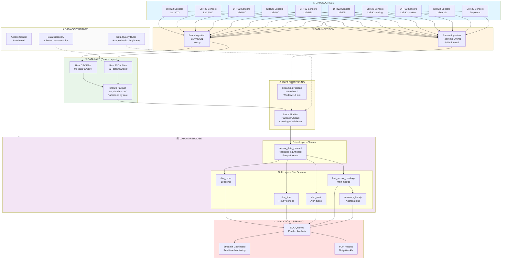

# Architecture Diagram - IoT Environmental Monitoring

# Lab Kebidanan Mega

## System Architecture (Lambda Architecture)

## Architecture Decisions

### 1. **Hybrid Architecture (Lambda)**

- **Batch Path**: Hourly ingestion untuk historical analysis
- **Stream Path**: Real-time monitoring untuk immediate alerts
- **Reason**: Balance between latency & cost

### 2. **Data Lake + Warehouse Combination**

- **Lake (Bronze)**: Raw data preservation, schema flexibility
- **Warehouse (Gold)**: Star schema untuk efficient queries
- **Reason**: Best of both worlds

### 3. **Storage Format Strategy**

| Layer | Format | Reason |
|-------|--------|--------|
| Raw | CSV, JSON | Human-readable, debugging |
| Bronze | Parquet | Compression, partitioning |
| Silver | Parquet | Fast queries |
| Gold | Parquet | Optimized analytics |

### 4. **SLA & Latency Targets**

- **Batch**: 1-hour latency, 99.9% reliability
- **Stream**: <30s latency, 99.5% reliability
- **Queries**: <2s response time
- **Retention**: Raw (30 days), Processed (1 year)
